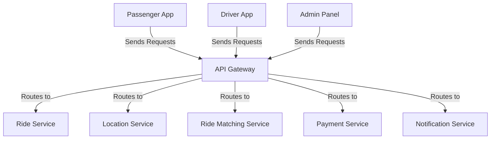

# API Gateway

The API Gateway is the central entry point for all client requests in the ride-booking system, handling authentication, rate limiting, and routing to microservices.

## Key Features
- Authentication and Authorization
- Rate Limiting
- Request Routing

## Recommended Tech Stack
- **Runtime**: Node.js for handling concurrent connections, paired with NGINX for frontend proxying and SSL encryption [1].
- **Framework**: Express.js for building RESTful APIs [1][3].
- **Load Balancing**: HAProxy for distributing traffic across microservices [1][4].
- **Authentication**: JWT or OAuth for securing endpoints.

## System Design Structure
- **Entry Layer**: NGINX handles incoming requests, manages SSL, and forwards to Node.js runtime.
- **Authentication Module**: Validates tokens before routing.
- **Routing Logic**: Directs requests to microservices based on endpoint paths.
- **Rate Limiting**: Prevents overload using custom middleware or HAProxy.
- **Logging**: Tracks requests for monitoring with ELK stack [1][4].

## Architecture Diagram

## Interaction with Other Services
The API Gateway facilitates communication between clients and backend:
- **Passenger App, Driver App, Admin Panel**: Receives all client requests for routing.
- **Ride Service**: Routes ride booking and management requests.
- **Location Service**: Handles location update requests.
- **Ride Matching Service**: Directs matching requests.
- **Payment Service**: Processes payment requests.
- **Notification Service**: Manages notification triggers.

