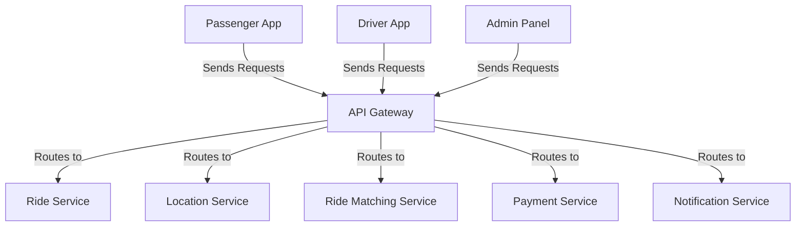

# API Gateway

The API Gateway is the central entry point for all client requests in the ride-booking system, handling authentication, rate limiting, and routing to appropriate microservices. It ensures secure and efficient communication.

## Key Features
- **Authentication and Authorization**: Validates user and driver requests before routing.
- **Rate Limiting**: Prevents system overload by controlling request frequency.
- **Request Routing**: Directs requests to relevant microservices based on functionality.

## Architecture Diagram

## Interaction with Other Services
The API Gateway is the intermediary between client applications and backend microservices, facilitating seamless interaction:
- **Passenger App, Driver App, Admin Panel**: All client requests are received by the API Gateway, which authenticates and routes them to the appropriate service.
- **Ride Service**: Receives ride booking and management requests routed from client apps.
- **Location Service**: Handles location update requests and queries for tracking and matching.
- **Ride Matching Service**: Gets requests for driver-passenger matching via the API Gateway.
- **Payment Service**: Processes payment-related requests routed from client interactions.
- **Notification Service**: Manages notification requests triggered by client actions or system updates.

